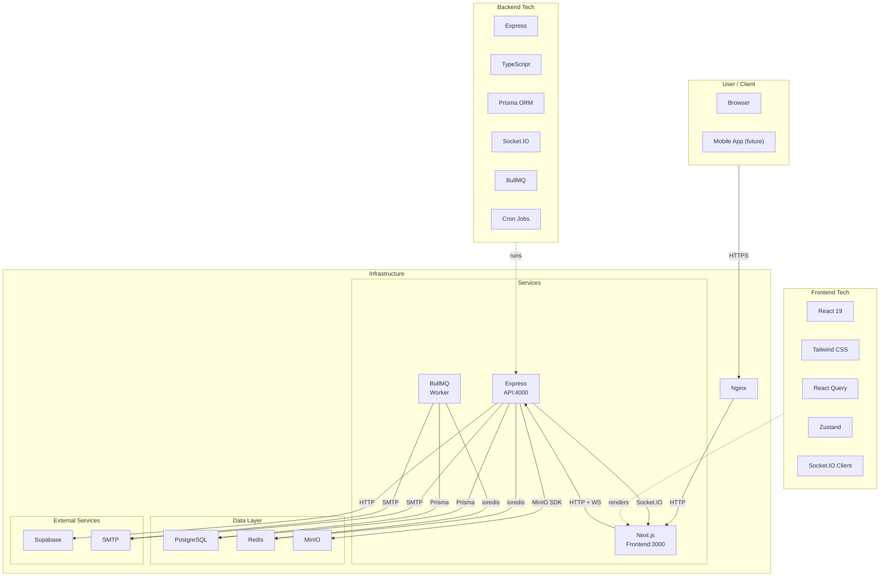

```mermaid
flowchart TB
    subgraph Client["User / Client"]
        Browser["Browser"]
        MobileApp["Mobile App (future)"]
    end

    subgraph Infra["Infrastructure"]
        Nginx["Nginx<br/Reverse Proxy"]
        
        subgraph Services["Services"]
            Frontend["Next.js<br/>Frontend:3000"]
            Backend["Express<br/>API:4000"]
            Worker["BullMQ<br/>Worker"]
        end
        
        subgraph Data["Data Layer"]
            PostgreSQL["PostgreSQL<br/DB"]
            Redis["Redis<br/Cache + Queue"]
            MinIO["MinIO<br/Object Storage"]
        end
        
        subgraph External["External Services"]
            Supabase["Supabase<br/Auth + Edge Fn"]
            SMTP["SMTP<br/Email"]
        end
    end

    Client -->|HTTPS| Nginx
    Nginx -->|HTTP| Frontend
    Frontend -->|HTTP + WS| Backend
    Backend -->|Socket.IO| Frontend
    Backend -->|Prisma| PostgreSQL
    Backend -->|ioredis| Redis
    Backend -->|MinIO SDK| MinIO
    Backend -->|HTTP| Supabase
    Backend -->|SMTP| SMTP
    Worker -->|ioredis| Redis
    Worker -->|Prisma| PostgreSQL
    Worker -->|SMTP| SMTP

    subgraph FrontendStack["Frontend Tech"]
        React["React 19"]
        Tailwind["Tailwind CSS"]
        ReactQuery["React Query"]
        Zustand["Zustand"]
        SocketClient["Socket.IO Client"]
    end

    subgraph BackendStack["Backend Tech"]
        Express["Express"]
        TypeScript["TypeScript"]
        PrismaOrm["Prisma ORM"]
        SocketIO["Socket.IO"]
        BullMQ["BullMQ"]
        Cron["Cron Jobs"]
    end

    FrontendStack -.->|renders| Frontend
    BackendStack -.->|runs| Backend
```